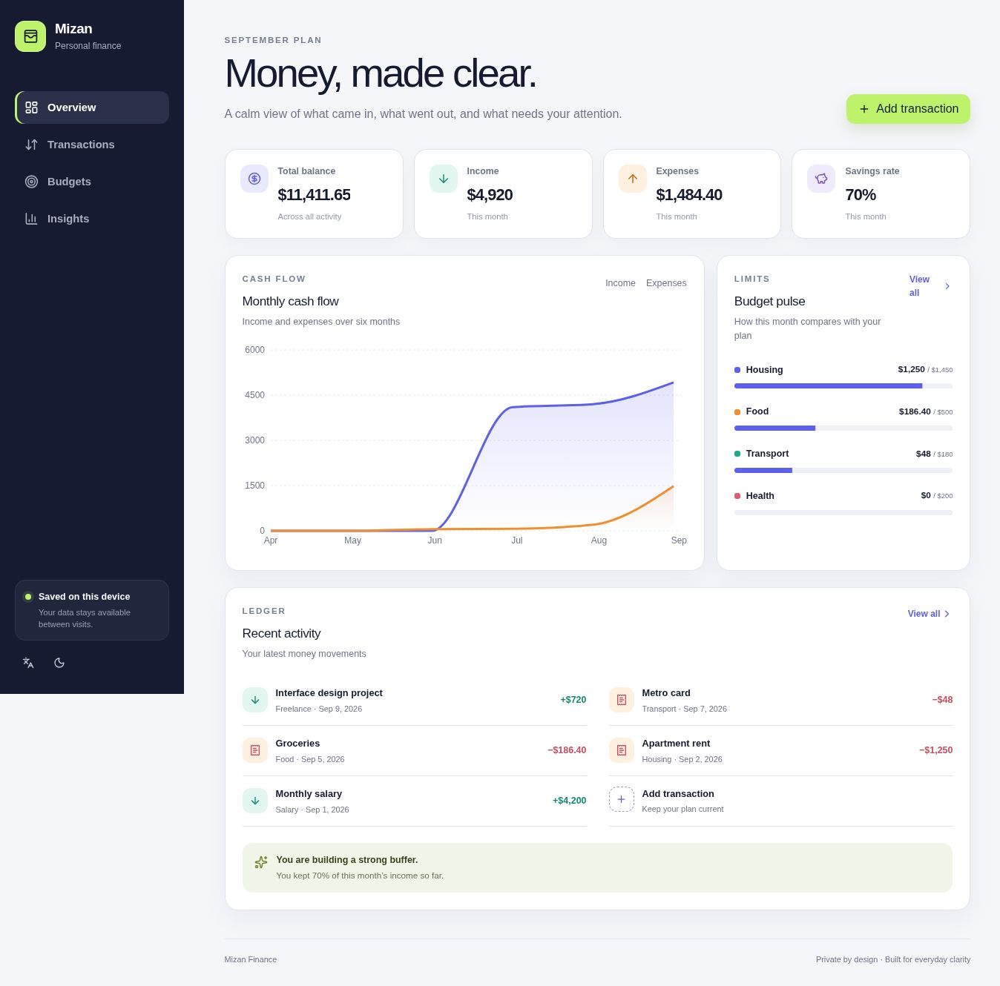
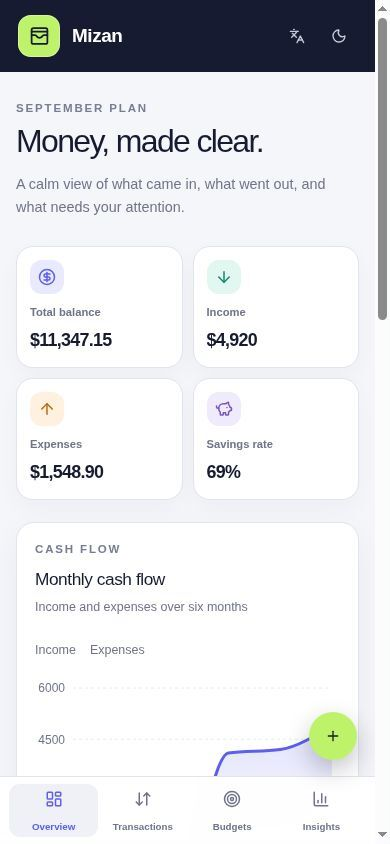

# Mizan Finance

Mizan is a bilingual, privacy-first personal finance planner built as a complete frontend application. It helps users record transactions, set category budgets, and understand spending patterns without connecting a bank account.

## Features

- Responsive dashboard for desktop, tablet, and mobile
- Transaction search, filtering, sorting, details, creation, editing, and deletion
- Validated transaction and budget forms with clear feedback
- Monthly category budgets and progress tracking
- Six-month cash-flow and category spending charts
- Persistent browser storage with loading, success, empty, and recoverable error states
- English/Arabic localization with RTL support
- Light and dark themes
- Accessible semantics, labels, focus states, keyboard controls, and reduced-motion support
- Automated behavior tests

## Routes

- `/` — financial overview
- `/transactions` — searchable transaction ledger
- `/budgets` — monthly category limits
- `/insights` — spending and cash-flow analysis
- Unknown routes — custom not-found state

## Project links

- Repository: https://github.com/rahman-997/mizan-finance
- Live demo: pending first Cloudflare Workers deployment

## Run locally

Requirements: Node.js 22.13 or newer. The npm scripts are cross-platform and work in PowerShell, Command Prompt, macOS, and Linux.

```bash
npm ci
npm run dev
```

Open the local address shown in the terminal.

## Validate, test, and build

```bash
npm run lint
npm run typecheck
npm test
npm run build
npm run test:ui
```

Run the complete local quality gate with:

```bash
npm run ci
```

The core finance behavior tests are intentionally independent from the production build, while the UI contract tests run after `dist/` exists.

## Deploy to Cloudflare Workers

Authenticate Wrangler once with your Cloudflare account, then deploy with:

```bash
npm run deploy
```

The deploy command performs a verified production build first and then deploys the Cloudflare Worker output.

## Architecture

The application uses Next-compatible file routing through Vinext, React and TypeScript for the UI, React Context for shared finance data, local component state for filters and dialogs, Zod plus React Hook Form for validation, Recharts for data visualization, and browser storage for persistence. Pure calculation helpers live in `lib/finance-utils.mjs` and are exercised by Node's built-in test runner.

See [PROJECT_SUBMISSION.md](./PROJECT_SUBMISSION.md) for the complete product definition, AI prompts, architecture explanation, chosen feature rationale, and reflection answers.

## Screenshots

### Desktop



### Mobile



## Privacy

Mizan does not transmit financial entries to a server. User-created data remains in the current browser's local storage.

## License

MIT
